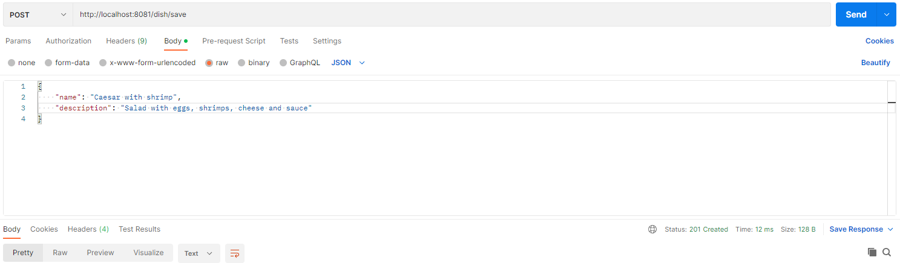
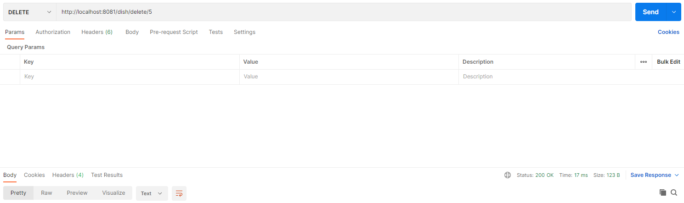

# job4j_dish

## Описание
Данное приложение наряду с job4j_admin является частью проекта по управлению списком блюд.  
Этот микросервис предоставляет REST API методы для управления списком.

## Стек технологий
* Java 17
* PostgreSQL 14
* Apache Maven 3.8.5
* Spring Boot 2.7.10
* Liquibase 4.9.1
* Lombok 1.18.26
* JUnit 5.8.2
* Mockito 4.5.1
* Checkstyle 10.7.0
* Thymeleaf 3.0.15

## Требуемое окружение для запуска проекта
* Браузер
* JDK 17
* Apache Maven 3.8
* PostgreSQL 14

## Инструкция по запуску проекта
1) Скачать и разархивировать проект
2) В PostgreSQL создать базу данных cinema (url = `jdbc:postgresql://127.0.0.1:5432/job4j_dish`)
3) Открыть командную строку и перейти в папку с проектом, например `cd c:\projects\job4j_dish`
4) Выполнить команду `mvn install`
5) Перейти в папку target командой `cd target`
6) Выполнить команду `java -jar job4j_dish-0.0.1-SNAPSHOT.jar`

## Взаимодействие с приложением

### HTTP-запрос на сохранение блюда 

### HTTP-запрос на обновление блюда

### HTTP-запрос на удаление блюда

### HTTP-запрос на получение всех блюд

### HTTP-запрос на получение блюда по id

### HTTP-запрос на получение блюда по имени

## Контакты для связи
&nbsp;&nbsp;
&nbsp;&nbsp;